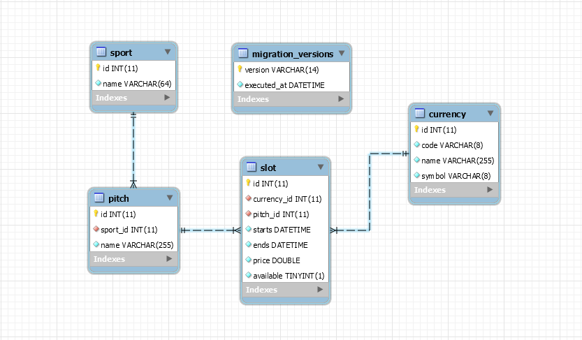
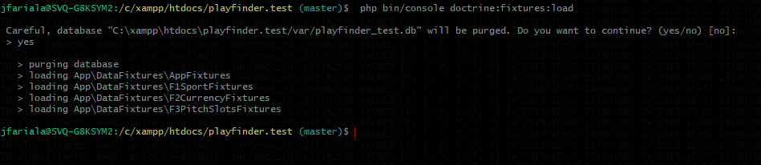
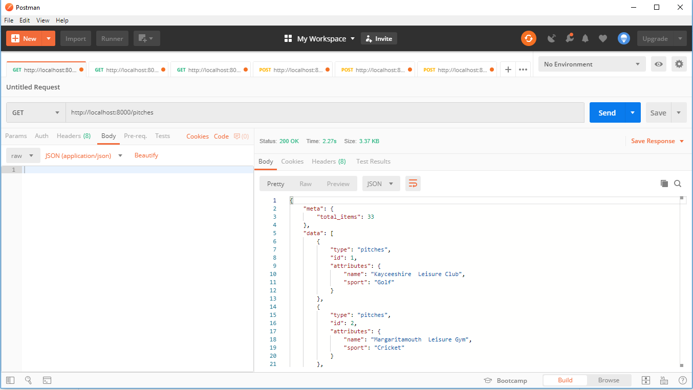
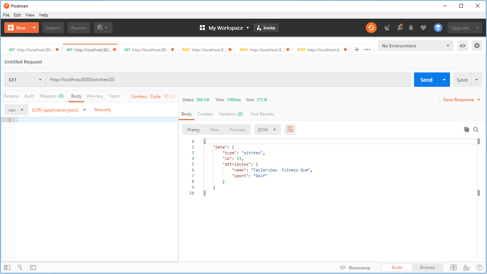
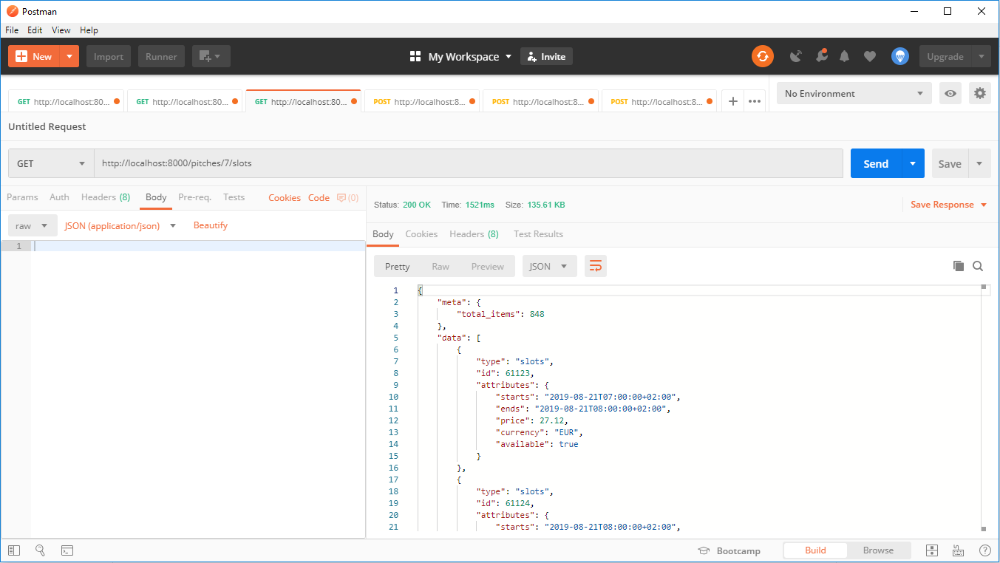
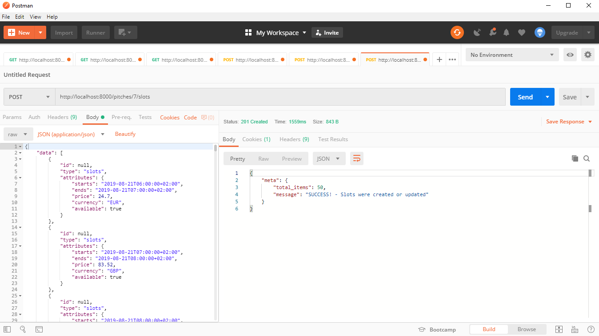
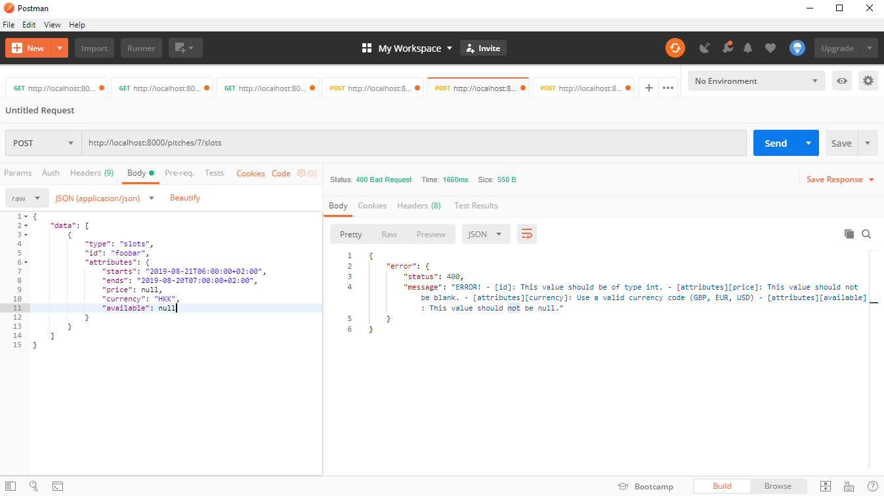
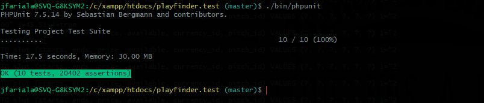

# Playfinder API REST (test)

This README.md file shows step by step how to install and run the Playfinder API REST.


Database Entity Relationship Model


## Stack:

- PHP >=7.1.3
- SQLite3
- Symfony 4.3.3  

## Requirements:

Server requirements in order to get the application running.

**Note:** The following requirements are Symfony framework requirements such the PHP extensions
which are installed and enabled by default in most PHP 7 installations (there is nothing to worry about).

- PHP >=7.1.3
- Composer
- SQLite3 
- MySQL >=10.2 (optional)

**PHP extensions:**

- PHP sqlite3 module
- PHP pdo_sqlite module
- Mbstring PHP Extension
- SimpleXML PHP Extension
- Tokenizer PHP Extension
- JSON PHP Extension
- Ctype PHP Extension
- iconv PHP Extension
- PCRE PHP Extension
- Session PHP Extension
- pdo
- pdo_mysql (optional)

## Cloning the repository from Github:

```
# cd /path/to/your/web/document/root 
# git clone https://github.com/lacroixDj/playfinder_test.git
# cd playfinder_test/
```

## Setup:

We need to install Symfony and all the required packages using composer:

```
# composer install 
```

The project's cache and logs directory in  **var/cache/** and **var/log/** must be writable by the web server. 

```
# chmod -R 775 var/cache/
# chmod -R 775 var/log/
```

For practical reasons we are using **SQLite**, so the database is  embeded inside the code  **var/playfinder_test.db**. So make sure to assign write permissions to that file. I thinks this is the most portable option.

If you prefer to use **MySQL** you will have to edit **.env** file, comment the SQLite line entry, after that uncomment the MySQL line entry and replace your connection params (user, host and pass) in the connection string.

Once the app is installed we proceed to run migrations in order to create DB Schema and tables and finally generate sample data by using fixtures. 


**Creating the Shema:**
```
# php bin/console doctrine:database:create 
```

**Making migrations:** This is only necesary if there is not any previous migration file generated under src/Migrations folder, or in case you want to switch your RDBMS from SQLite to MySQL o viceversa you should create the migrations file again. 
```
# php bin/console make:migration 
```

**Running migrations:** This will create and/or alter Database schema objects
```
# php bin/console doctrine:migrations:migrate 
```

**Loading data fixtures:** This is for populating the database with generated sample data, if you are curious about and want to take a look just check Fixtures files in **src/DataFixtures/** 
```
# php bin/console doctrine:fixtures:load 
```
If it's ok you will see:


## Running the server:

Finally we need to start the embeded web server that comes out of the box with Symfony. 

**Option 1:**
```
#  php bin/console server:run 
```
If everything wents fine we should see an ouput like this:
```
# [OK] Server listening on http://127.0.0.1:8000
```

**Option 2:** If you have the Symfony binary already installed on your host:
```
#  symfony server:start 
```
If everything wents fine we should see an ouput like this:
```
# [OK] Web server listening on http://127.0.0.1:8000 (PHP CGI 7.1.17)
```

## API REST endpoints
The applications provides all the endpoints required:

- **GET http://localhost:8000/pitches** -> Get all Pitches from the database in JSON Format.




- **GET http://localhost:8000/pitches/{$id}** -> Get a Pitch by the given **$id**.




- **GET http://localhost:8000/pitches/{$id}/slots** -> Get all Slots by the given Pitch **$id**.



- **POST http://localhost:8000/pitches/{$id}/slots** -> Insert/update slots information for a given pitch **$id**.




## Validations
Data input validations and bussines logic validations were implemented for the POST endpoint method:

- Valid data structure
- Valid data types
- Valid datetime formats
- Slot "ends" dateime attribute can't be earlier than "starts" datetime
- Valid currencies codes.
- And so on.

**Validations example:**


## DB Schema
Model entities used

- **Sport:**  Sports table (1:N) with Pitches
- **Currency:** Currencies table (1:N) with Slots
- **Pitch:** Pitches tabble (N:1) with Sports and (1:N) with slots.
- **Slot:** Slots tabble (N:1) with Currencies and (1:N) with Pitches.


## Testing:
Automated tests,  mostly functional tests, were developed and included, covering RW+ operations for each API Rest endpoint. 

If you want to run tests:
```
#  ./bin/phpunit 
```
If everything goes well (as expected) you will see:


## Improvements for Future versions:
I would really love to Dockerize the application to increase its portability running as isolated services regardless of the the native host machine requirements.

The idea is to orchestrate the app with **docker-compose** and run three services (containers) with **NGNX** as web server + **PHP-fpm** as fast cgi processor + **PostgreSQL** as database.

Due time and deadline reasons (this is a technical test) this improvement will be considered for possible future versions

## Contact:

If you have any question you can reach me at <jesus.farias@gmail.com>

**Thanks!**